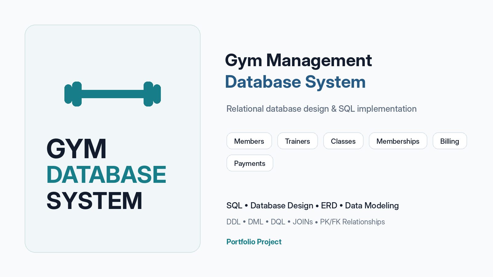
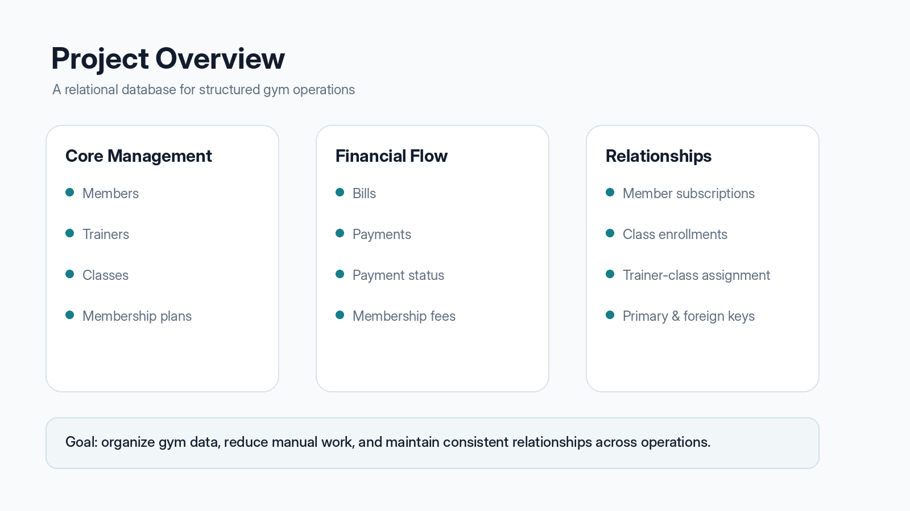
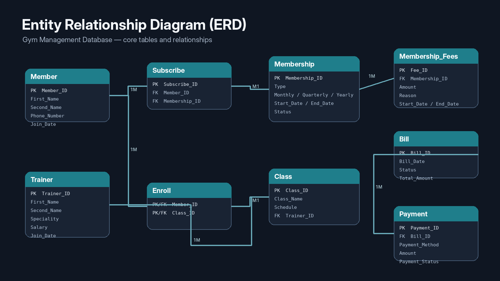
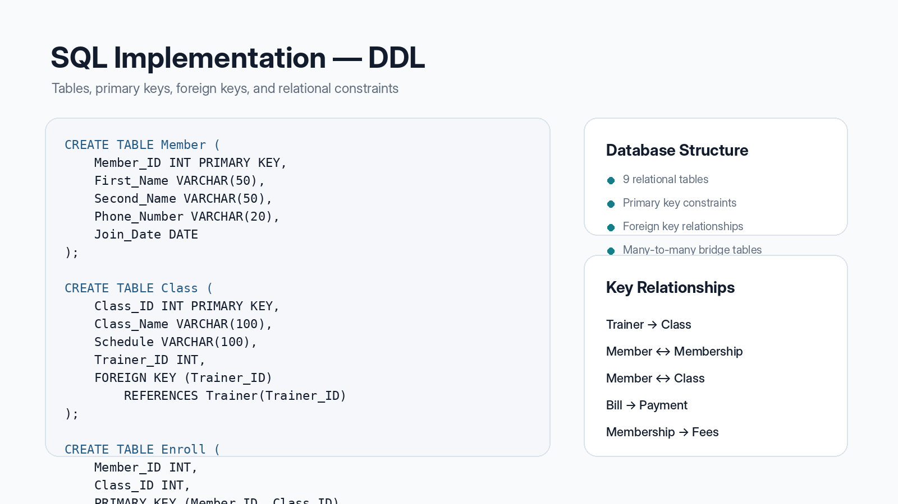

# Gym Management Database

A relational SQL database project designed to manage core gym operations including members, trainers, classes, memberships, subscriptions, billing, payments, and class enrollment.



---

## Project Overview

The goal of this project is to design and implement a structured relational database for managing gym operations.

The system organizes data related to:

- Members
- Trainers
- Gym classes
- Membership plans
- Membership fees
- Subscriptions
- Bills
- Payments
- Class enrollments

The project demonstrates relational database design, primary and foreign keys, table relationships, SQL data manipulation, JOIN queries, filtering, and aggregation.

---

## Database Design

The database contains **9 relational tables**:

1. `Member`
2. `Trainer`
3. `Class`
4. `Membership`
5. `Membership_Fees`
6. `Bill`
7. `Payment`
8. `Subscribe`
9. `Enroll`



---

## Entity Relationship Diagram

The database uses primary and foreign key relationships to connect the different parts of the gym system.

Examples include:

- A trainer can be assigned to multiple classes.
- A member can subscribe to a membership plan.
- A membership can have associated fees.
- A bill can have payment information.
- Members can enroll in multiple classes.
- Classes can contain multiple members through the `Enroll` table.



---

## Database Schema

### Member
Stores gym member information such as:

- Member ID
- First and second name
- Gender
- Phone number
- Address
- Join date

### Trainer
Stores trainer information including:

- Trainer ID
- Name
- Speciality
- Salary
- Join date
- Birth date

### Class
Stores gym classes and their assigned trainers.

### Membership
Stores membership plans, prices, dates, and status.

### Membership Fees
Stores fees associated with membership plans.

### Bill
Stores billing information and payment status.

### Payment
Stores payment method, amount, date, and payment status.

### Subscribe
Connects members to their membership plans.

### Enroll
Represents the many-to-many relationship between members and classes.

---

## SQL Operations

The project includes different categories of SQL operations.

### DDL — Data Definition Language

The `ddl.sql` file creates the database structure including:

- Tables
- Primary keys
- Foreign keys
- Data types
- Table relationships



---

### DML — Data Manipulation Language

The `dml.sql` file contains sample data and modification operations.

Examples include:

- `INSERT`
- `UPDATE`

The database includes sample records for members, trainers, classes, memberships, fees, bills, payments, subscriptions, and class enrollments.

---

## SQL Queries

The `dql.sql` file contains queries used to retrieve and analyze information from the database.

Examples include:

- Displaying members and trainers
- Retrieving classes with assigned trainers
- Viewing members with their membership plans
- Filtering paid and unpaid bills
- Retrieving members enrolled in classes
- Counting subscriptions by membership type
- Calculating completed payment revenue
- Summarizing payments by method
- Combining billing and payment information

---

## JOIN Query Example

JOIN operations are used to retrieve related information from multiple tables.

Example:

```sql
SELECT
    Class.Class_Name,
    Class.Schedule,
    Trainer.First_Name,
    Trainer.Second_Name,
    Trainer.Speciality
FROM Class
JOIN Trainer
    ON Class.Trainer_ID = Trainer.Trainer_ID;
